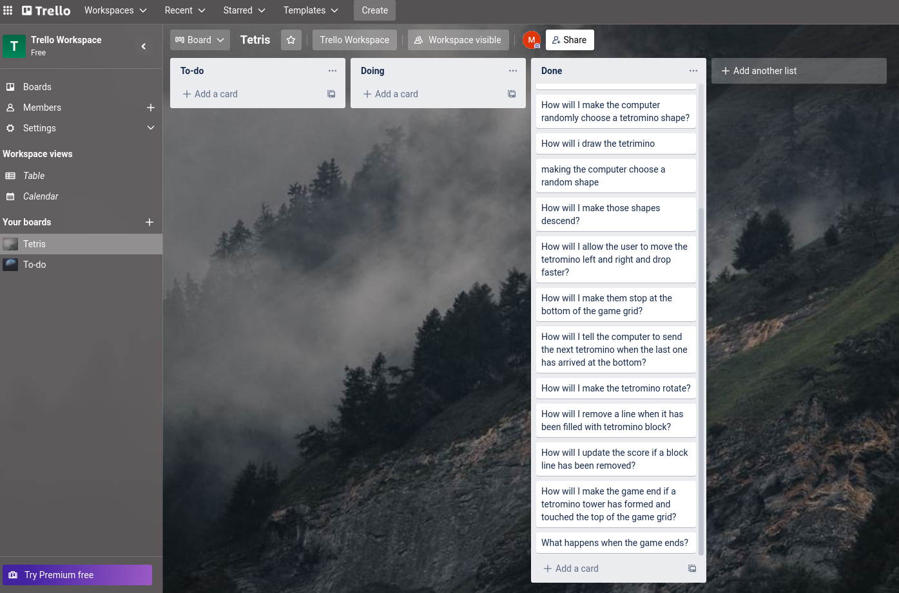
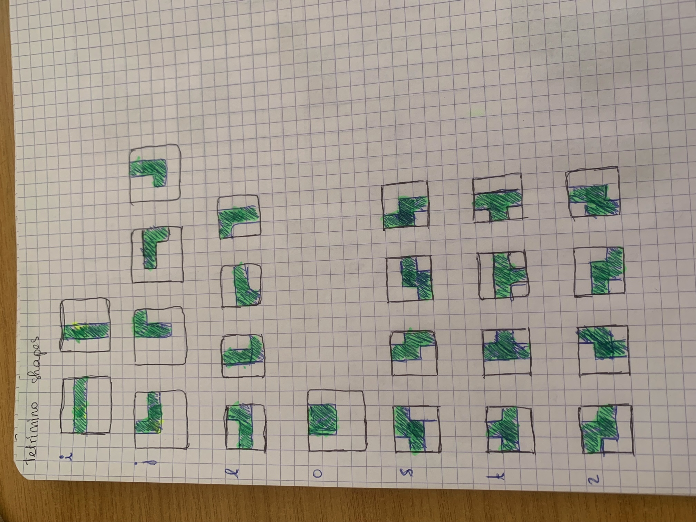

# Project 1: Tetris

## Project Description
----
Tetris is a falling block puzzle game commonly known around the world. The main goal of the game is to try to prevent the blocks from stacking up to the top of the game board for as long as possible. As my project, I decided to recreate this classic game. 

## Deployment Link
----
You can follow this link to try my Tetris project:
[Tetris](https://manohisoavicky.github.io/project1-tetris/)


## Time Frame and Working Team
----
This project, which was to be done individually, had a time frame of two weeks. 

## Technologies Used
----
The technologies used for this projects were:
* HTML
* CSS
* JavaScript
* Chrome's Developer Tools
* Visual Studio Code

## Brief
----
* Render a game in the browser
* Design logic for winning
* Visual display of the winner
* Separate files for HTML, CSS, and JavaScript
* Stick with KISS and DRY principles
* Ise of DOM manipulation
* Deploying the game online
* Semantic markup for HTML and CSS

## Planning
----
### Trello
The first thing I did before writing code was plan the things I had to do. To do this, I decided to use Trello. In the Trello board below, you can see some of the questions I asked myself at the beginning of my project. As I progressed, I answered those questions one by one. Hence, the reason why they are all in the Done list.




### Sketches
Sketching was also very helpful. As my project was a game, seeing a visual representation of things was convenient. 




## Code Process
----
Although Tetris is a straightforward game to play, building it is a whole different process. It is complicated and requires a lot of planning. 


### Defining the Variables and Getting the DOM Elements
The first thing I did was defining the variables, one of which was the tetromino shapes, and getting the DOM elements I would be needing for the game.


### Creating the Game Grid
Once I had my variables and DOM elements, I decided to create the game grid. For this, I decided to use arrays as I thought it would be easier for me to manipulate later on. 

```  function createGrid() {
    for (let i = 0; i < numOfRows; i++) {
      grid[i] = [];
      for (let j = 0; j < numOfColumns; j++) {
        grid[grid.length - 1].push(0);
      }
    }
  }
  createGrid(); 
```

In the code above, I iterate over the number of rows. For each row, I create an empty array. Then, still in the for loop, I create another for loop to iterate over the number of columns. I then fill the rown arrays with 0s. 


### Drawing the Tetrominos
After I created the grid, I decided to draw the tetrominos. For this project, I decided to use HTML canvas. Canvas was still very new to me, so it took me some time to figure things out.

I had defined the different tetromino shapes in two-dimensional arrays. Those arrays were filled with 0s and 1s. 
(Found below is a small example of how the tetromino shapes look like in code. )
   
```
[
  [0, 1, 1],
  [1, 1, 0],
  [0, 0, 0],
]
```
Tetris would not be fun if the same shape kept coming over and over again. Hence, I created a function to randomly choose the tetromino shapes.
To draw the tetromino shapes, I decided to iterate over the shape's rows and columns using forEach(). As I iterate, I check the values of the elements. As I showed earlier, the tetromino shapes are made up of 0s and 1s. The 0s are empty blocks and the 1s are colored blocks. Hence, if the value is 1, I color it.


### Fall Motion
After I drew the tetromino, I added the fall motion. 

```
function fall() {
    let motion = setInterval(() => {
      if (collisionDetection()) {
        clearInterval(motion);
        updateGrid(grid, shape);
        if (gameOver()) {
          if (window.confirm("Game Over! Would you like to play again?")) {
            location.reload();
          }
          return;
        }
        resetPositions();
        startGame();
        return;
      }
      if (currentY >= numOfRows - getShapeHeight()) return;
      draw();
      currentY += 1;
    }, fallTime);
    return;
  }
```

Due to the fall motion, I initially created another function to erase the tetromino once it was drawn and draw it once again but a row lower to give it a falling motion. However, I discovered requestAnimationFrame(). This made things much easier for me.


### Key Event Listeners
For Tetris, I decided to use the direction keyboards to move the tetrominos around. 


#### *Moving Horizontally*
To move horizontally, I created a function that would take a number as its argument. The numbers I chose were 1 and -1. One would mean moving one cell to the left, and negative one would mean moving one cell to the right. This means that if the number was 1, the x coordinate would increase by 1, and if it was -1, the x coordinate would decrease by one.

However, before allowing any movement, the tetrominos needed to be inside the boundaries, and they needed to return false once I checked for a collision detection. 


#### *Moving Down*
The function to move down works similarly to the function to move horizontally, except for the fact that instead of having the x coordinate changed, since we are moving down, we are changing the y coordinate. 


#### *Rotating*
The rotations was a bit tricky. I spent quite some time sketching and trying different scenarios to make sure that my rotation function would work on all shapes. 


### Collision

There are many different types of collisions in Tetris. I had to make sure that it detected collision when the tetromino hit the bottom, or the left and right borders. I also had to make sure that it would detect collision when another tetromino was right below it, or at its left and right. 

Because of those different situations, I created numerous different functions. Additionally, the tetromino shapes were all different, so I had to make sure those functions would work for all shapes. Furthermore, most of the shapes had arrays filled with 0s, which I also had to take into consideration. 


I ended up creating functions to help me get the shape's height for the bottom collision. Below is a function to check whether the left side of a tetromino is filled with 0s. 

```
  function isLeftVoid() {
    if (shape.length === 3) {
      if (shape[0][0] === 0 && shape[1][0] === 0 && shape[2][0] === 0)
        return true;
    } else if (shape.length === 4) {
      if (
        shape[0][0] === 0 &&
        shape[1][0] === 0 &&
        shape[2][0] === 0 &&
        shape[3][0] === 0
      )
        return true;
    }

    return false;
  }
```

I also created a similar function but for the right side. I also created a function for when the tetromino would collide with another tetromino when moving horizontally. 


### Updating my Grid
Once my functions detected a collision, I would update my grid. 

```
  function updateGrid(grid, shape) {
    shape.forEach((row, y) => {
      row.forEach((value, x) => {
        if (value === 1) {
          grid[y + currentY][x + currentX] = value;
        }
      });
    });
    removeLine();
  }
```
In the code above, I iterate over my shape array. I then check if the value is 1. If it is one, I update my grid by taking the coordinates (currentX and currentY) and adding the x and y of my shape. 

Once updated, I remove any lines that need to be removed. 

```
  function removeLine() {
    for (let x = numOfRows - 1; x >= 0; x--) {
      if (full(grid[x])) {
        grid.splice(x, 1);
        grid.unshift([0, 0, 0, 0, 0, 0, 0, 0, 0, 0]);
        x++;
        score += 100;
        lines += 1;
        playerScore.textContent = score;
        playerLines.textContent = lines;
      }
    }
  }
```
In the removeLine() function, I iterate over the rows starting from the bottom. I check whether any of the rows are full. If they are, I remove them with splice and add another array filled with 0s at the top. 


### Game Over

Since no game would be fun if it does not end, I made sure to stop my game once it has detected a game over. To detect a game over, I created a function to check whether grid[0] had any element that had the value of 1. If any of the elements do, game over!


## Challenges
----
My biggest challenge in this project was detecting the collisions. There were many different scenarios that would create a collision. Additionally, I had to be able to detect those collisions even when the tetromino had rotated. 

Taking all those scenarios into consideration, I decided to create various functions that would each solve an issue of their own instead of creating just one collision detection function. Once I had decided that I would break the collision function into other small collision function, it was easy for me to focus on just one problem at a time. 


## Wins
----
One of the wins in this project was the draw function. I initially created another function to remove the drawn tetromino shape. However, I ended up with a long function. I decided to scheme through the internet to try to find a solution, and I found requestAnimationFrame(). I found that very helpful and insightful. I managed to get rid of my remove tetromino function, and write a better function instead.

Having the tetrominos rotate was also a win for me. It was quite challenging to make sure the function would work all the shapes.


## Key Learnings
----
With this project, I managed to discover a lot, such as how to use Chrome's developer tools sources panel.

My understanding of JavaScript definitely increased a lot. I was also able to improve my problem solving and debugging skills.


## Bugs
----
My Tetris game has a delay. Sometimes, there would be a delay in the fall of the next tetromino even though the other one has already been locked in place. The same goes for when a line is full. There's a delay for removing the lines. I believe this bug has something to do with the fall motion, more precisely in the setInterval part. 

Additionally, in most Tetris games, the tetromino should be able to move one last time horizontally once it has collided with something at the bottom. However, I was not able to recreate that last movement. 
A bug also occurs when a tetromino shape collides with a locked shape on its right or left side. It will still continue to fall, however, it will stay glued to the side it collided with. 

Furthermore, if you play the game for a prolonged period of time, the tetromino movements will start to lag behind the keyboard actions.


## Future Improvements
----
* Pause button
* Fixing the bugs
* Allowing one last move when bottom collision occurs
* Faster tetromino drop as score increases


